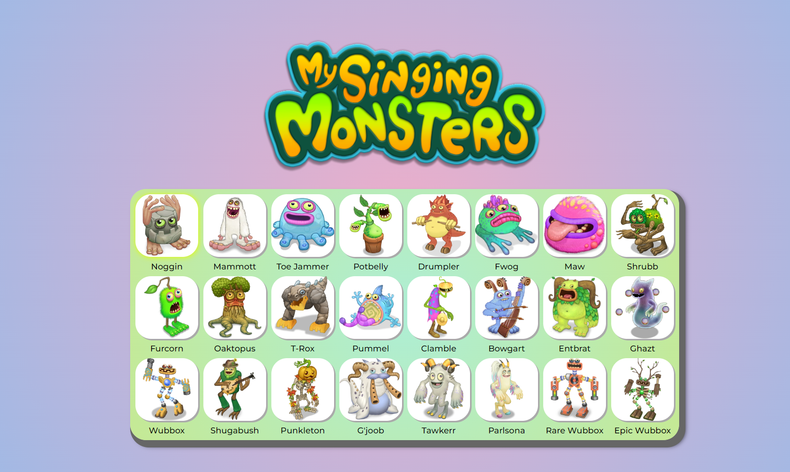

# My Singing Keyboard

Projeto "My Singing Keyboard" utilizando os conceitos de HTML, CSS e JavaScript.

## Screenshots

## Ferramentas Utilizadas

- HTML
- CSS
- CSS Grid
- JavaScript

## Feito por:

Lucas Kenji
